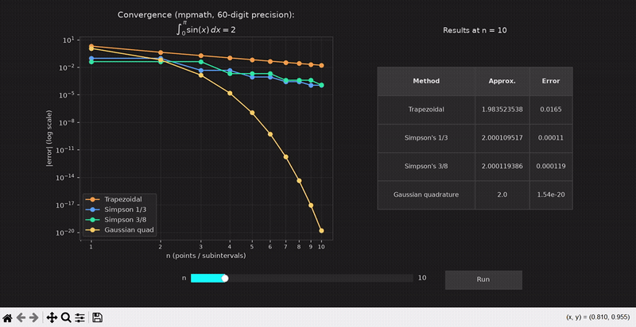

# Numerical Integration Methods Explorer

An interactive tool comparing four numerical integration methods at arbitrary precision, with a live convergence plot and a results table.



*Dragging the **n** slider and clicking **Run** redraws the log-log convergence plot for all four methods and updates the results table with each method's approximation and error.*

## Methods

1. **Trapezoidal rule** (composite, degree-1 Newton-Cotes)
2. **Simpson's 1/3 rule** (composite, degree-2 Newton-Cotes)
3. **Simpson's 3/8 rule** (composite, degree-3 Newton-Cotes)
4. **Gaussian quadrature** (Gauss-Legendre; nodes and weights are computed at working precision via the Golub-Welsch eigenvalue method, not looked up from a fixed-precision table)

## Why arbitrary precision?

Gaussian quadrature converges so fast on a smooth function that, with ordinary double-precision (float64) numbers, its error hits the ~1e-16 machine-epsilon floor almost immediately. Past that point you are no longer seeing the method's real truncation error, just round-off noise, which does not shrink monotonically and can even tick back *up* slightly as more terms are summed.

This project uses [mpmath](https://mpmath.org/) at 60 decimal digits of working precision, pushing the round-off floor down to roughly 1e-60, far below anything reached in this demo. Every convergence curve therefore shows genuine truncation error across its full range, not an artifact of floating-point precision.

## Features

- Interactive **n slider** (1-60) in the plot window, with a **Run** button to recompute
- Live convergence plot (log-log error vs. n) for all four methods
- Results table showing the approximation and error at the chosen n
- Dark theme UI, consistent with the author's other simulation projects
- `gauss_legendre_nodes_weights` and other expensive per-n computations are memoized with `functools.lru_cache`, so repeated use of the slider and Run button does not redo work already computed

## Requirements

- Python 3.9+
- See `requirements.txt`

## Setup

```bash
git clone https://github.com/linkedaven/Numerical-Integration-Methods.git
cd Numerical-Integration-Methods
pip install -r requirements.txt
```

## Usage

```bash
python integral_sol.py
```

Drag the **n** slider to the number of points or subintervals you want, then click **Run**. The convergence plot redraws showing every n from 1 up to your chosen value, and the results table updates to show each method's approximation and error at that n.

## Test problem

By default, the script evaluates:

```
I = integral of sin(x) from 0 to pi = 2
```

To try a different function, edit `f(x)` near the top of the script. It is an `mpmath`-based function, so use `mp.sin`, `mp.exp`, etc. rather than plain Python `math`. Then update `a`, `b`, and `I_exact` to match your new problem and its known closed-form answer.

## License

MIT, see [LICENSE](LICENSE).
